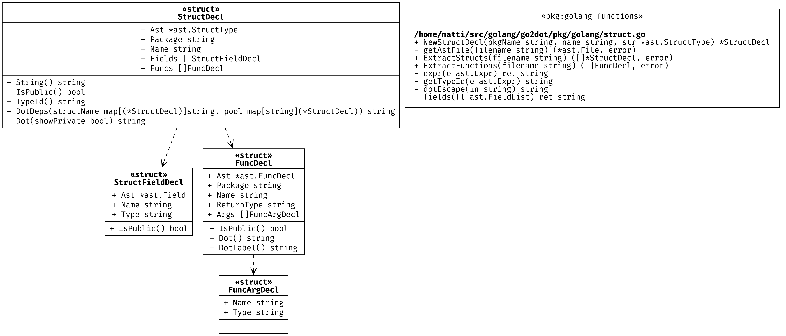

# vscode-go2dot-view

This plugin generates an uml-like graph of your golang code.

Example output:



## Features

This plugin adds an action "GO: view package" that will generate an image of the package for the currently open golang file.

## Requirements

You need the following installed and in your PATH:
- [golang](https://go.dev/doc/install)
- [git](https://git-scm.com/downloads)
- [graphviz/dot](https://graphviz.org/download/)


Example install with [brew](https://docs.brew.sh/Installation):
```shell
# Install git
brew install coreutils git

# Install dot
brew install graphviz

# Install golang
brew install golang

```

## Extension Settings

This extension contributes the following settings:

* `goViewPkg.showPrivate`: Show private variables and functions.
* `goViewPkg.dotCmd`: `dot` executable (Default is to pick up the dot command from the PATH).
* `goViewPkg.extraOptions`: Extra options for `dot` when rendering the image.<br/>Here's an example that uses custom fonts and increases the resolution of the image: `-Gfontname="Fira Code" -Nfontname="Fira Code" -Gsize=4,3 -Gdpi=1000`
* `goViewPkg.format`: Which [format](https://graphviz.org/docs/outputs/) to product the image in.
* `goViewPkg.go2DotDir`: Directory for the [go2dot utility](https://github.com/pehrs/go2dot). This plugin will clone the go2dot utility if this directory does not yet exist (default: `${HOME}/.config/vscode-go2dot-view/go2dot`)

## Known issues

- No unit test yet :-(

## Release Notes

### 1.0.0

Initial release
